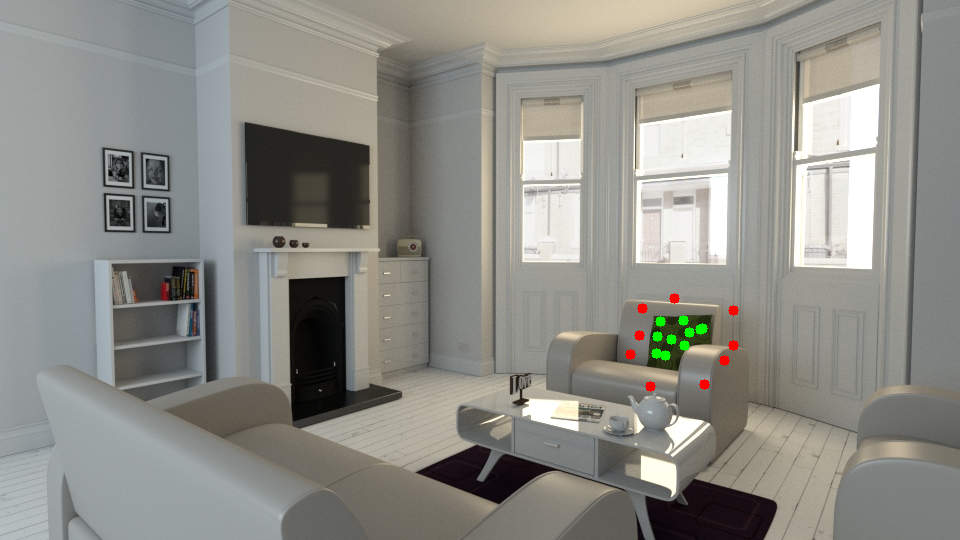
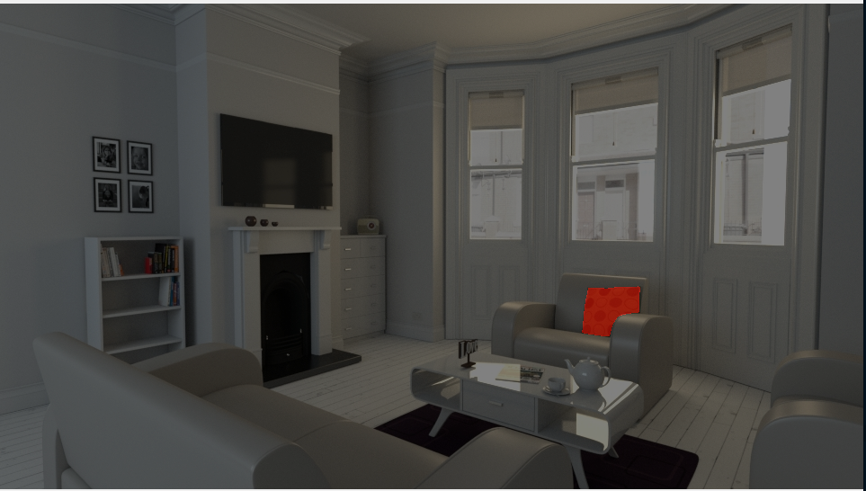

# Interactive Object Selector
This script serves the purpose to segment single objects in images.
We use OpenCV to display and interact with the images and SAM to predict the masks.




## Prerequisites

Please make sure to install 

```opencv-python, numpy, torch, segment_anything, tyro```

and download the segment_anything model that you would like to use.

## Run

Invoke the script with

```python3 main.py --path <path_to_your_images> --ext <extension_of_images>```

## Instructions

You can select regions in the image that are part of the objet by left-clicking. You can exclude regions by right-clicking.
(On the first frame, right-clicking will lead to pop-ups. They do not occur on subsequent frames.)

After you selected the object, press 'q'. Then SAM will predict the mask for the object and visualize it. If you are happy with the mask,
press 'y'. Else, press 'n'. If you pressed 'n', you will be prompted to select the object again.